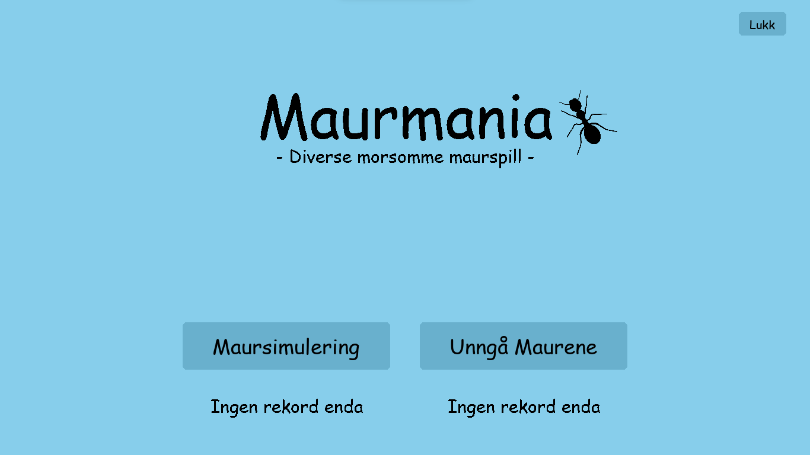
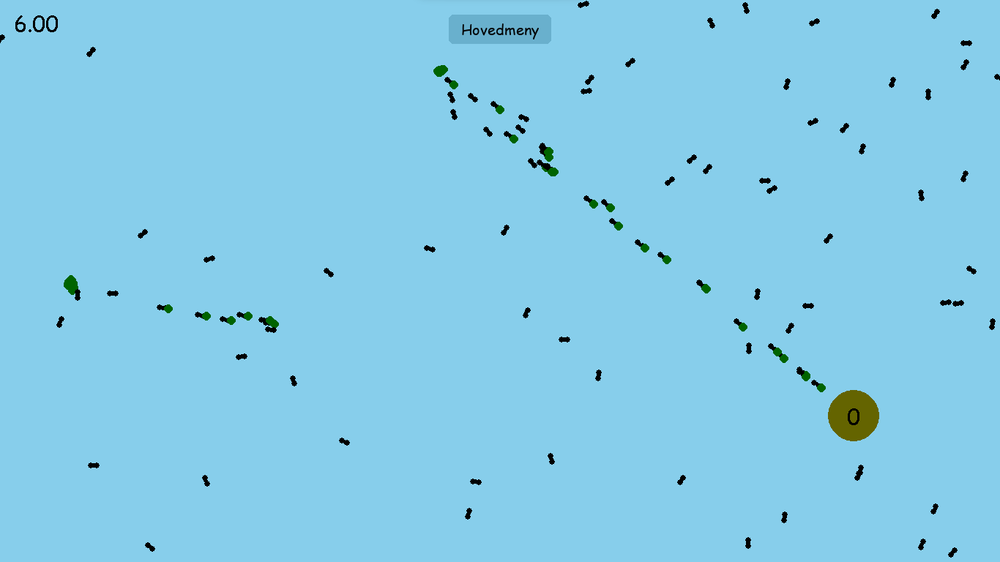
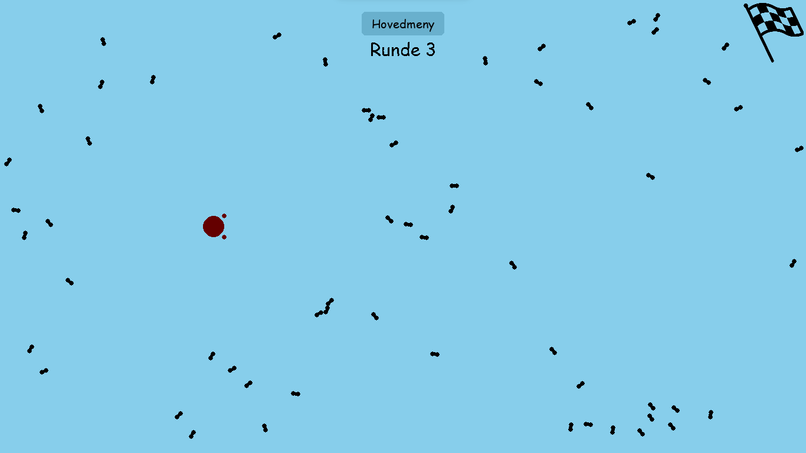

# Maurspill i Python

Dette prosjektet er en implementering av et maurspill i Python, opprettet som et skoleprosjekt for faget IT2 (Informasjonsteknologi 2). Spillet består av to mindre spill: et simuleringsspill og et unngåspill. I det første spillet kan brukeren observere en simulering av maur som samler mat og bringer den tilbake til maurtuen sin. Den andre delen av spillet involverer å navigere gjennom et område og komme til mål uten å bli truffet av maur.

## Hovedmeny

I hovedmenyen kan brukeren velge mellom de to tilgjengelige spill: simuleringspillet og unngåspillet. Hovedmenyen gir også tilgang til ytterligere informasjon om spillet og instruksjoner om hvordan man spiller.

## Simuleringsspillet

I denne delen av spillet kan brukeren velge en vandringsgrad mellom 0.5 og 2.5.
Denne vandringsgaden sier noe om hvor mye maurene svinger frem og tilbake når de vandrer.
Simuleringen går ut på at maurerne vil bevege seg rundt på skjermen og gå mot maten hvis de oppdager den, og deretter ta den med tilbake til maurtuen.
Dette gir en visuell representasjon av logikk og matte

## Unngåspillet (Unngå maurene spillet)

I unngåspillet må spilleren navigere fra nederst i venstre hjørne til mål som ligger øverst til høyre uten å bli truffet av maurene.
Målet er å nå sluttpunktet uten å kollidere med noen av maurene. Dette utfordrer spillerens reaksjonsevne og strategiske tenkning.
Spillet blir vanskeligere og vanskeligere for hver runde.

## Skjermbilder

### Simuleringsspillet

### Unngåspillet

## Installasjon

1. Last ned eller klon dette git-repositoriet.
2. Åpne terminalen og naviger til mappen der prosjektet er lagret.
3. Kjør `python hovedmeny.py` for å starte spillet. (Alternativt: Kjør maurmania.bat)

## Krav

Dette spillet krever Python 3.x for å kjøre, samt noen eksterne biblioteker som kan installeres via pip.
disse inkluderer pygame og random.

## Bruk

Etter at spillet har startet, følg instruksjonene på skjermen for å navigere gjennom menyene og spille de ulike modusene.

